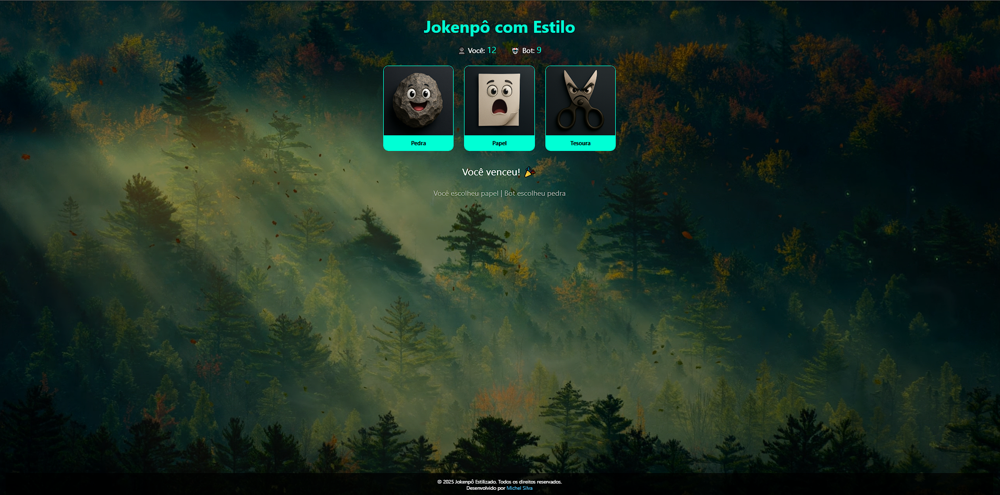

# 🪨📄✂️ Jokenpô com Estilo

Um projeto divertido e visualmente estilizado do clássico **JoKenPo (Pedra, Papel e Tesoura)**, com foco em animação, responsividade e experiência interativa com imagens e vídeo de fundo.

## 🔥 Demonstração


<!-- Certifique-se de que o GIF esteja salvo no caminho correto, como "assets/preview.gif" -->

> **Link ao vivo [Ver Demo](https://jokenpomichel.netlify.app/)

---

## 📱 Recursos

- 🎮 Lógica de jogo com placar em tempo real
- 🎨 Interface com imagens animadas e labels personalizados
- 🎥 Vídeo de fundo com escurecimento e estilo imersivo
- 📱 Totalmente responsivo para mobile e desktop
- 🧠 Bot com jogadas aleatórias

---

## 🧩 Tecnologias

- HTML5
- CSS3
- JavaScript (puro)

---

## 🚀 Como usar

1. Clone o repositório:
   ```bash
   git clone https://github.com/seu-usuario/jokenpo-estilizado.git
